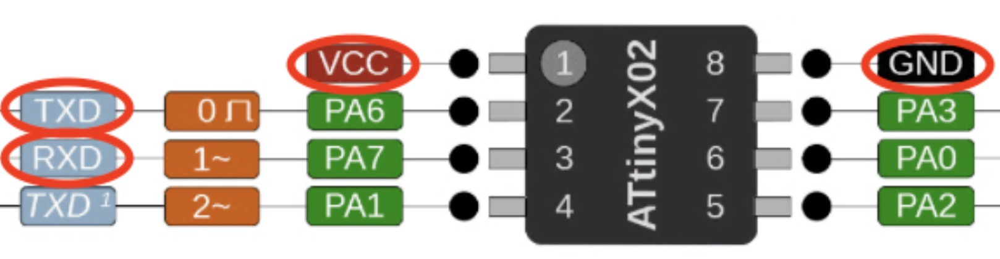

# Badge 2024 - Reverse Engineering

This repository contains the information and scripts used in the introductory talk of the third edition of C1B3RTR4CKS. During the talk, a small demonstration of the reverse engineering process on a hardware device was conducted.


## Datasheet

The badge consists of a button cell battery and a series of LEDs controlled by an ATTINY202. If we look at the microcontroller's datasheet, we find that it has the following pin configuration:


To program the microcontroller, we use the UPDI port. The printed circuit board exposes 3 pins, including this one (VCC, UPDI, and GND).

This microcontroller is 5V tolerant, so we can power it with either 5V or 3.3V.

The microcontroller can be programmed with the Arduino interface. To do this, we can use the MegaTinyCore project, which downloads the necessary configuration files for us. In this [post](https://www.electronics-lab.com/project/getting-started-with-the-new-attiny-chips-programming-the-microchips-0-series-and-1-series-attiny-with-the-arduino-ide/) we have the necessary steps to install it in our IDE. 


Once installed, we need a UPDI programmer. We can get a commercial one or use the [jtag2updi](https://github.com/ElTangas/jtag2updi) project to make one with an Arduino we have.

In our case, we built a programmer using an Arduino Nano and some pogo pins to program the board quickly.


## Scripts

To program the board, we can use the `upload` script as follows:

```
% ./upload
Usage: ./upload serial_port filename.hex

Ej:
./upload /dev/tty.usbserial filename.hex
```

To read the contents of the microcontroller and save it to a file, we use the `read` script:

```
% ./read
Usage: ./read serial port filename.hex

Ej:
./read /dev/tty.usbserial dump.hex
```

Make sure to use the correct serial port. In our case, on MacOS, we use the `show_ports` script to list them.

> **_Important:_**  Before using the scripts, you need to modify them to adjust the paths for the `avrdude` binary and the `avrdude.conf` file. You can see these paths in the Arduino console when you upload a sketch.


## Serial output

According to the microcontroller's datasheet, it has 2 serial ports. In the C1B3RTR4CKS example, we use the main port:



To connect, we can solder wires to the microcontroller or use a DIP8 Test Clip to facilitate access. Then, with a USB-to-Serial converter, we can view what the board writes to the port and interact with it.

Using the Python script `serial_conn.py`, we can open an interactive console to send and receive messages from the board."

```
python3 -m pip install -r requirements.txt

Ej: 
python3 serial_conn.py /dev/tty.usbserial 9600
```


